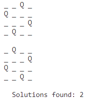

# Blocked N Queens Solver as a Constraing Satisfaction Problem

Blocked N-Queens is a variant of the N-Queens problem.
In Blocked N-Queens problem, we also have NxN chessboard 
table and N queens. Each square can hold at most one queen. 
Some squares on the table are blocked and cannot hold any 
queens. The condition is that the queens must not attack
each other. The input of this problem is the number of queens and 
blocked fields

To execute the code just type on the terminal: python blocked_n_queens_with_csp.py

A view of the execution for the 4-queen problem

The provided code solves the N-queens problem using the OR-Tools library. The code takes two inputs: the board size and a list of blocked positions where queens cannot be placed. It then uses constraint programming to find all possible solutions and prints them out. The solutions are displayed as a grid, where 'Q' represents a queen and '_' represents an empty space. The total number of solutions found is also printed.

